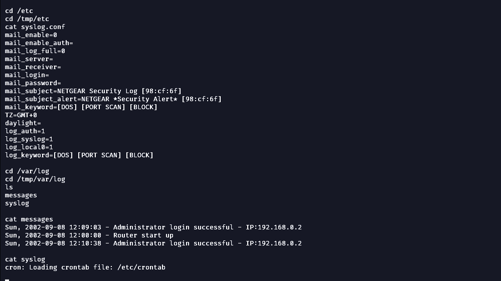
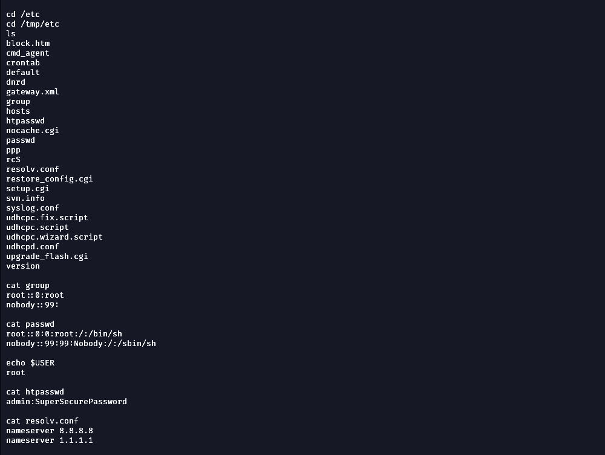

# UniTS Cybersecurity (436MI) Report: Exploiting TCP/32764 Vulnerability & Reverse Engineering an Old Netgear Wireless Router

Nicolò Ermanno Millo

## Introduction

In this document, I will demostrate how pursue a MITM threat attack againt endpoints connected to compromised wireless router. 


## Threat Model

To align the exercise with a real scenario, the following threat model is considered throughout the entire document:

Given an operational Netgear DG834Gv3 wireless router, it is assumed that the attacker has the capability to connect to the same Local Area Network (LAN) managed by the device.


## Reconnaissance

Generally, even before connecting to an access point, it is possible to visually inspect the physical device and recognize its model. If not, it is still possible to gather the same information using Nmap.

&nbsp;

  
_Figure 1: Nmap command [^5]_

&nbsp;

However, this approach is not encouraged because it can be potentially noisy in terms of network traffic, making it more detectable. In fact, Nmap, to complete the OS detection, sends more than 1000 TCP packets to the device. This is a considerable amount of traffic, especially considering that the gathered information may not be complete. 

While the OS and manufacturer can be identified, the model remains unknown, which is the crucial piece of information.

[^5]: https://nmap.org/book/osdetect-usage.html#osdetect-ex-scanme1

Another way to obtain the desired information is to observe and interact with the services provided by the device. For instance, Nmap detected an HTTP service on port 80, which is likely an admin web panel.

&nbsp;

  
_Figure 2: Unauthorized access web page of http service._

&nbsp;

Within the HTML of the page, there is a meta tag "description" that discloses what is being searched for. The device is identified as a wireless router (+ switch + modem) of the Netgear DG384* series. Although the precise model remains unknown, it is not necessary for this purpose.

This approach appears to be less detectable, as network traffic is reduced and more conventional. However, it's worth noting that after a failed authentication attempt on the admin panel, a notification to the administrator is triggered. At the current stage of the attack, this uncertainty cannot be addressed.

## Backdoor unveiling

When it was determined that we are connected to a Netgear DG834G* device, it might be planned to exploit a hidden backdoor.

This device, like many other systems based on Sercomm modem, exposes a backdoor that can be exploited to gain administrative rights and manipulate local network resources without admin credentials [^2]. Interestingly, it is not a mistake in itself, but rather an arbitrary hidden functionality (CWE-912)[^1], probably part of a Sercomm updating tool.

These claims are supported by the fact that after the vulnerability disclosure, the subsequent firmware patches did not close the backdoor but instead merely hid it[^5]. Even today, it can be reactivated by sending a proper packet[^3].

[^1]: “NETGEAR ROUTER DG/DGN/DM/JNR/WPNT PORT TCP/32764 BACKDOOR”, VulDB, https://vuldb.com/?id.11715 (accessed Apr. 21, 2024). 
[^3]: J. Ullrich , “Port 32764 router backdoor is back (or was it ever gone?) ,” SANS Technology Institute - Internet Storm Center, https://isc.sans.edu/diary/Port+32764+Router+Backdoor+is+Back+or+was+it+ever+gone/18009 (accessed Apr. 21, 2024). 
[^5]: E. Vanderbeken, "How Sercomm saved my Easter! Another backdoor in my router: when Christmas is NOT enough!", Synactiv, https://www.synacktiv.com/ressources/TCP32764_backdoor_again.pdf (accessed Apr. 21, 2024). 

None comments on these facts was released by Sercomm and Netgear[^2].

[^2]: S. Gallagher, “Easter egg: DSL router patch merely hides backdoor instead of closing it”, Ars Technica, https://arstechnica.com/information-technology/2014/04/easter-egg-dsl-router-patch-merely-hides-backdoor-instead-of-closing-it/ (accessed Apr. 21, 2024).

### Exploit


Communication with the backdoor was defined as a TCP-based undocumented protocol. Eloi Vanderbeken at Synactiv successfully reverse-engineered it using IDA Pro[^6]. Subsequently, a Python Proof-of-Concept and a Metasploit module were developed.

[^6]: E. Vanderbeken, "TCP/32764 backdoor Or how linksys saved christmas!", Github, https://github.com/elvanderb/TCP-32764/blob/master/backdoor_description_for_those_who_don-t_like_pptx.pdf (accessed Apr. 21, 2024). 


There are significant differences between them.

The Proof-of-Concept (PoC) was specifically developed for the Linksys WAG200G wireless router; however, it effectively works for the Netgear DG834Gv3 as well. Nevertheless, there are no assurances regarding compatibility with other devices. Additionally, the script can be utilized to directly access various Sercomm protocol methods, including a non-reversed root-associated remote shell.

On the other hand, the Metasploit module is capable of operating with a wide range of routers and offers many different payloads, including a Linux reverse shell. A notable difference is that neither of them opens a root shell. Instead, the associated account is "nobody". This class of account is generally used as a low privilege debug account to prevent severe compromises of remote systems[^4]. Nevertheless, it seems to have read access rights almost everywhere.

[^4]:  O. Kirch, Why NFS sucks”, Suse/Novell inc., Proceedings of Ottawa Linux Symposium 2006, https://www.kernel.org/doc/ols/2006/ols2006v2-pages-59-72.pdf (accessed Apr. 21, 2024).

Although the differences, both are based on the same protocol and TCP packets exchange is equiparable.

&nbsp;

  
_Figure 3: Wireshark capture of remote shell init with python PoC_

&nbsp;

To better understand the reason for this payload and the functioning of the protocol in general, the Proof-of-Concept (PoC) and documentation are useful. The protocol itself is not complicated: its payload passes over the network in plaintext without any authentication or complications, requiring only a hardcoded header dictated by the router. Specifically, it is defined by the endianness of the router.

&nbsp;

```python

def send_message(s, endianness, message, payload=''):
    """
    Send a message via open TCP connection to TCP/32764 vulnerable device

    Parameters:
    s         (socket) : Description of arg1
    endianess (char)   :
    message   (int)    : Index of backdoor functionality
    payload   (string) : Textual parameters to  chosen functionality 

    Returns:
    ret_val   (string) : Returning value
    ret_str   (string) : Returning string
    """

    header = struct.pack(endianness + 'III', 0x53634D4D, message, len(payload)+1)
    s.send(header+payload+"\x00")
    r = s.recv(0xC)

    while len(r) < 0xC:
	tmp = s.recv(0xC - len(r))
	assert len(tmp) != 0
	r += tmp

	sig, ret_val, ret_len = struct.unpack(endianness + 'III', r)
	assert(sig == 0x53634D4D)

	if ret_val != 0:
		return ret_val, "ERROR"

	ret_str = ""
	while len(ret_str) < ret_len:
		tmp = s.recv(ret_len - len(ret_str))
		assert len(tmp) != 0
		ret_str += tmp

return ret_val, ret_str

# ...

# ... if/elif discriminates PoC args

elif args.shell : # Poc arg : --shell
    print(send_message(s, endianness, 7, 'echo "welcome, here is a root shell, have fun"')[1])
    while 1 :
        print(send_message(s, endianness, 7, sys.stdin.readline().strip('\n'))[1])

#...
```
&nbsp;

Code released with Beerware licence. Unique modifications conecerns the added comments [^7].
[^7]: https://github.com/elvanderb/TCP-32764/blob/master/LICENSE


## Firmware exploration

Once a shell is opened, it is crucial to examine the functionalities and configurations of the system.

Before taking any action, and as quickly as possible, it is critical to verify the logging policy of the device. If properly configured, the mere access to the backdoor and the earlier reconnaissance actions may generate logs, which would then be sent to an administrator.

&nbsp;

  
_Figure 4: The Markdown Mark_

&nbsp;

Fortunately, none of the actions are registered in the logs. Furthermore, the log configuration file indicates that the strictest logging policy is enabled. It is also important to note that successful accesses to the admin web panel are logged.

There is a good chance to work undisturbed, but in any case, it is possible to temporarily modify the log policy.

After reviewing the logs, it is critical to understand which user is associated with the shell, their access rights, and the composition of the firmware to gather any sensitive information. This assessment allows the attacker to grasp the magnitude of their privilege within the system and devise a feasible attack accordingly.

&nbsp;

  
_Figure 5: Busybox list of all its programs._

&nbsp;

Not surprisingly, the firmware has a considerably compact memory footprint. This aspect practically reflects on the number of programs installed on it. The majority of programs are made available by the Busybox software suite. Therefore, the firmware can be classified as embedded Linux.

Unfortunately, the available programs are not numerous and are also not regularly updated. Additionally, installing new ones is challenging. This aspect is crucial because it dictates the manner in which the system can be compromised.

&nbsp;

  
_Figure 6: The Markdown Mark_

&nbsp;

Achieving admin credentials to the web panel conceptually does not grant any more privilege than being root in the shell. However, working on HTTP is potentially less detectable because it is less anomalous.

As mentioned earlier, admin authentication on the web panel is logged, so the first step should be to modify syslog.conf.

Summing up all the information gathered, in the next section, I will propose a set of feasible configuration modifications to compromise other devices attached to the router.

## Modifying system configuration

Given the limited functionalities of the device, an easily feasible modification is changing the DNS configuration to route DNS requests to an attacker-controlled DNS server. This can be configured to respond to certain DNS requests with the IP addresses of malicious web servers, potentially facilitating a Man-in-the-Middle (MITM) scenario.

&nbsp;

  
_Figure 7: DNS configuration page of admin web panel._

&nbsp;

With the support of the compromised router, it is now possible to set up a malicious DNS server using the bind9 service. Finally, a malicious website on the domain postesicure.com has been created.

The objective is to recreate a critical web application in order to intercept sensitive information.

&nbsp;

  
_Figure 8: Malicious webpage loaded next to DNS traffic to malicious DNS server._

Indeed, employing a proxy instead of a local website would be a more effective approach. A proxy allows for more flexibility and control over the intercepted traffic, enabling the attacker to manipulate requests and responses in a more sophisticated manner. This not only facilitates the interception of sensitive information but also enables the attacker to inject malicious content or perform other advanced attacks more easily.

Furthermore an entire DNS server was within

Redirecting network traffic by configuring route tables is indeed a slightly different approach compared to using a proxy or setting up a malicious DNS server. With this method, iptables-controlled routes are less detectable with only the admin web panel, as this specific configuration may not be fetched by the panel.

However, it's important to note that the version of iptables on the device is considerably old, which means many more advanced functionalities may not be available. Despite its feasibility, this limitation should be kept in mind when considering this approach for the attack.

## Reverse engineering 

Reconstructing the firmware of the router to add functionalities is indeed a straightforward way to implement more advanced offensive techniques. This can be easily achieved through an interface within the web panel, which allows for firmware modification. However, it's important to note that this method may increase the likelihood of detection, especially if significant changes are made.

As a precaution, it's advisable to make minor changes to the firmware to reduce the risk of detection. Nonetheless, it's important to acknowledge that a reboot of the device is inevitable after firmware modification.

Modifying a genuine firmware bit by bit carries high risk, even when using specialized tools such as binwalk or firmware-modkit. If the procedure fails, the consequences can range from the update being rejected due to image hash issues to rendering the device inoperable, requiring physical intervention for recovery. Therefore, caution should be exercised when undertaking such modifications.

## Conclusions

Indeed, mitigation measures can be implemented to address the weaknesses exploited in this attack. One effective mitigation strategy is to firewall port 32764 on the web panel, effectively preventing access to the backdoor. By blocking access to this port, the vulnerability exploited in the attack is mitigated, significantly reducing the risk of unauthorized access and exploitation.
